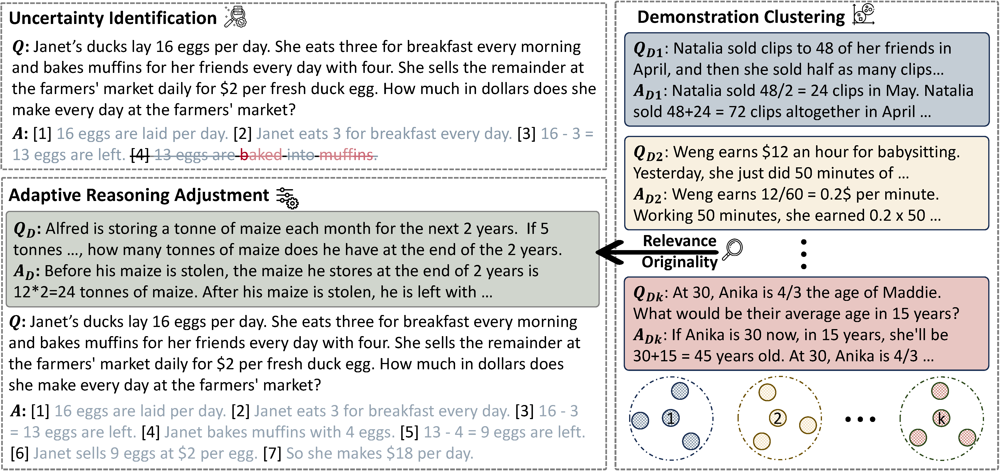

# Reasoning in Flux: Enhancing Large Language Models Reasoning through Uncertainty-aware Adaptive Guidance


ACL 2024: [Reasoning in Flux: Enhancing Large Language Models Reasoning through Uncertainty-aware Adaptive Guidance](https://aclanthology.org/2024.acl-long.131/)

## Introduction 📝

This repository contains the code and data related to the paper "[Reasoning in Flux: Enhancing Large Language Models Reasoning through Uncertainty-aware Adaptive Guidance](https://aclanthology.org/2024.acl-long.131.pdf)". In this paper, we delve into the underlying factors contributing to reasoning errors in Large Language Models (LLMs) and introduce **Uncertainty-aware Adaptive Guidance (UAG)**, a novel approach for guiding LLM reasoning onto an accurate and reliable trajectory.



## Quick Links 🔗

- [Requirements 📚](#requirements-)
- [Data 💾](#data-)
- [Quick Start 🚀](#quick-start-)
  - [Parameter Explanations](#parameter-explanations)
  - [Tips](#tips)
- [Bug or Questions? 🤔](#bug-or-questions-)
- [Citation 📖](#citation-)

## Requirements 📚

Please make sure you have the following requirements installed:

```python
import json
from collections import defaultdict
import torch
import torch.nn.functional as F
from transformers import AutoModel, AutoModelForCausalLM, AutoTokenizer
from sklearn.cluster import KMeans
import numpy as np
from tqdm import tqdm
```

## Data 💾 

Our dataset originates from [Large Language Models are Zero-Shot Reasoners](https://github.com/kojima-takeshi188/zero_shot_cot/tree/main/dataset), generously shared by Takeshi Kojima. We employ prompts from [Chain-of-Thought Prompting Elicits Reasoning in Large Language Models](https://arxiv.org/pdf/2201.11903.pdf) to guide models in generating initial reasoning processes.

## Quick Start 🚀

We provide a simple script in [main.py](code/main.py) to launch the GSM8K task using UAG:

```python
subprocess.call(
    "python uag.py \
        --task GSM8K \
        --data-path GSM8K_input.jsonl \
        --record-path GSM8K_output.jsonl \
        --demonstration-path GSM8K_demonstration.jsonl",
    shell=True,
)
```

### Parameter Explanations

To help you better understand and utilize the script, here is a detailed explanation of the parameters, grouped by their functionalities:

#### **Task and Data Parameters:**

- `--task`: (*str*, default=`"GSM8K"`)  
  **Description**: The name of the task to perform. Examples include `"GSM8K"`, `"AQuA"`, `"CSQA"`, etc.

- `--data-path`: (*str*, default=`"UAG_input.jsonl"`)  
  **Description**: The path to the input data file in JSON Lines format.

- `--record-path`: (*str*, default=`"UAG_output.jsonl"`)  
  **Description**: The path where the output records will be saved.

- `--demonstration-path`: (*str*, default=`None`)  
  **Description**: The path to the demonstrations file. This can be used to specify task-specific prompts.

- `--demonstration-number`: (*int*, default=`16`)  
  **Description**: The number of demonstrations to use. This helps in constructing diverse and high-quality demonstrations.

#### **Uncertainty and Adjustment Parameters:**

- `--theta`: (*float*, default=`16`)  
  **Description**: The uncertainty threshold. This determines when UAG should intervene in the reasoning process.

- `--lambda1`: (*float*, default=`0.5`)  
  **Description**: Weight for the relevance score in the uncertainty computation.

- `--lambda2`: (*float*, default=`0.5`)  
  **Description**: Weight for the originality score in the uncertainty computation.

- `--k`: (*int*, default=`8`)  
  **Description**: The number of clusters for demonstration clustering.

#### **Generation Parameters:**

- `--temperature`: (*float*, default=`0.5`)  
  **Description**: The temperature for text generation. Higher values result in more diverse outputs.

- `--max-length`: (*int*, default=`2048`)  
  **Description**: The maximum sequence length for generated outputs.

- `--max-loop`: (*int*, default=`10`)  
  **Description**: The maximum number of loops (iterations) allowed in the reasoning process.

#### **System Parameters:**

- `--device`: (*str*, default=`"cuda"`` if available, else `"cpu"`)  
  **Description**: The device to use for computation. Can be `"cuda"` or `"cpu"`.

### Tips

1. **Open-Source Embedding Model**:  
   We use the open-source embedding model ["nvidia/NV-Embed-v2"](https://huggingface.co/nvidia/NV-Embed-v2), which eliminates the cost overhead associated with paid embedding models. We have found that this embedding model has good consistency with the Mistral model.

2. **Custom Prompts**:  
   In [prompt.py](code/prompt.py), we provide some prompt examples. We recommend constructing diverse and high-quality demonstrations for different tasks. You can specify `--demonstration-path` to further expand task-specific prompts.

3. **Adapting UAG to New Tasks**:  
   You can adapt UAG to new reasoning tasks and scenarios by modifying the `adaptive_reasoning_adjustment` function in `uag.py`. Additionally, you can adjust hyperparameters like `theta`, `lambda1`, `lambda2`, and the generation `temperature` to achieve better performance. You can also customize your uncertainty calculation method; we have provided the `compute_uncertainties` function to facilitate the construction of task-specific uncertainty computation methods.

## Bug or Questions? 🤔

If you have any suggestions or questions, feel free to email us at [yinzhangyue@126.com](mailto:yinzhangyue@126.com). If you encounter any issues while using the code, or if you find any bugs, please open a new issue on GitHub. We are very open to any constructive feedback that could help us improve. Thank you for your attention!

## Citation 📖

If you are interested in our work, please use the following citation format when referencing our paper:

```bibtex
@inproceedings{yin-etal-2024-reasoning,
    title = "Reasoning in Flux: Enhancing Large Language Models Reasoning through Uncertainty-aware Adaptive Guidance",
    author = "Yin, Zhangyue  and
      Sun, Qiushi  and
      Guo, Qipeng  and
      Zeng, Zhiyuan  and
      Li, Xiaonan  and
      Dai, Junqi  and
      Cheng, Qinyuan  and
      Huang, Xuanjing  and
      Qiu, Xipeng",
    editor = "Ku, Lun-Wei  and
      Martins, Andre  and
      Srikumar, Vivek",
    booktitle = "Proceedings of the 62nd Annual Meeting of the Association for Computational Linguistics (Volume 1: Long Papers)",
    month = aug,
    year = "2024",
    address = "Bangkok, Thailand",
    publisher = "Association for Computational Linguistics",
    url = "https://aclanthology.org/2024.acl-long.131",
    doi = "10.18653/v1/2024.acl-long.131",
    pages = "2401--2416"
}
```